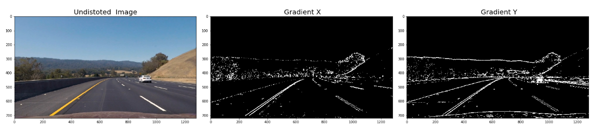
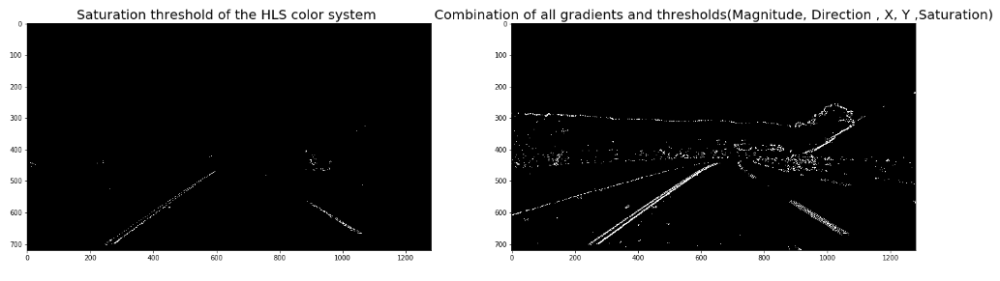
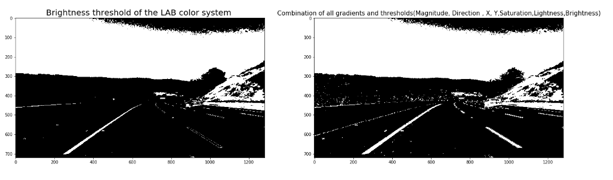
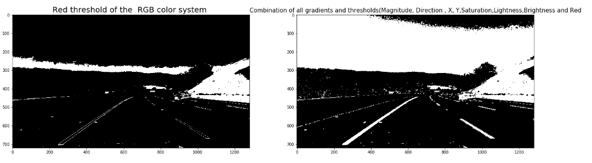
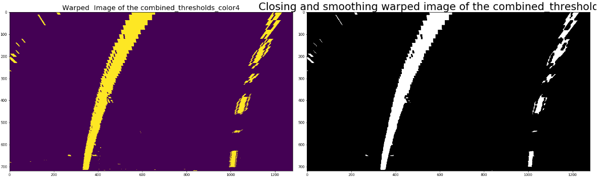
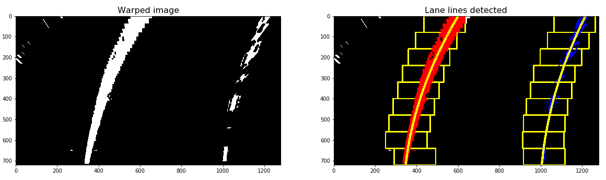

### Advanced Lane Finding:

The goal of this project is to write a software pipeline to identify the lane boundaries in a video, but the main output or product we want you to create is a detailed writeup of the project.


The steps of this project are the following:

* Compute the camera calibration matrix and distortion coefficients given a set of chessboard images.
* Apply a distortion correction to raw images.
* Use color transforms, gradients, etc., to create a thresholded binary image.
* Apply a perspective transform to rectify binary image ("birds-eye view").
* Detect lane pixels and fit to find the lane boundary.
* Determine the curvature of the lane and vehicle position with respect to center.
* Warp the detected lane boundaries back onto the original image.
* Output visual display of the lane boundaries and numerical estimation of lane curvature and vehicle position.

### Instructions:

* The images for camera calibration are stored in the folder called camera_cal. The images in test_images are for testing the pipeline on single frames. To extract more test images from the videos, you can simply use an image writing method like cv2.imwrite(), i.e., you can read the video in frame by frame as usual, and for frames you want to save for later you can write to an image file.

* The examples of the output from each stage of the pipeline saved in the folder called output_images, and included a description in this writeup for the project of what each image shows. The video called project_video.mp4 is the video your pipeline should work well on.

* The challenge_video.mp4 video is an extra (and optional) challenge for you if you want to test your pipeline under somewhat trickier conditions. The harder_challenge.mp4 video is another optional challenge and is brutal!

[//]: # (Image References)


## Rubric Points

##### Here I will consider the rubric points individually and describe how I addressed each point in my implementation.  

---

1.  Compute the camera calibration matrix and distortion coefficients given a set of chessboard images: To calculate camera calibration for Images that are stored in the folder called camera_cal, I compute the camera matrix and distortion co-efficients to undistort the all images. I used the calibration_calculate, cal_distortion functionsto calulate calibration matrix and distortion coefficients and then by using undistortion functions (in the corners_unwarp functions) i undistorted all images and by using  the corners_unwarp function I transformed them to Front view. An example of a distortion-corrected image is presented below:
<p align="right">

<p align="right">


2.  Gradients and color thresholds,Sobel X , Y , Magnitude and Direction Gradients: 

*   First I applied thresholds on X, Y (abs_sobel_thresh function), magnitude (mag_thresh function) and direction (dir_threshold function) gradients to combine them into a binaray image(named combined_gradient) by using combined_thresholds function.
<p align="right">

<p align="right">
 <p align="right">

<p align="right">
 
 *  Then I combine the binary image from the previous step (combined_gradient)  with  of the threshold color channel H from HLS color spaces (HLScolor function) to obtain a binary image (combined_thresholds_color1) and then use this binary image to combine with the thresol L channel from LUV space color (LUVcolor function) to get another binary image (combined_thresholds_color2) and then use the resulted binary image from the previous step to combine with the threshold R channel from RGB (RGBcolor function)and the resulted image (combined_thresholds_color3) from previous step with the threshol L channel from LAB colorsystem to obtain the binary threshold image 4 (combined_thresholds_color4).
 
 <p align="right">

<p align="right">
 <p align="right">

<p align="right">
 <p align="right">

<p align="right">
 <p align="right">

<p align="right">


3. Perspective transform ("birds-eye view"): First, I extracted the source and distinction points to perform a perspective transformation with help of the calc_warp_points function, then I feed the binary threshold image from the previous step into the transform_image() function to get a bird's eye view from above which will be rectified by adding morphological dilation and erosion to make the edge lines continuous. 

 <p align="right">

<p align="right">
 <p align="right">

<p align="right">

4.  Nois Detection: In this step Noise will be detected by using a function named noise_detect and if the result of this function is True, instead of using the combined_thresholds_color4 variable wir are goining to use the variable combined_thresholds_color1 which has better result in noisy images for Perspective transforming (step 3).


5. Implementing of sliding Windows and Fit a Polynomial: In order to detect the lane pixels from the warped image, First, a histogram of the lower half of the warped image is created by using the get_histogram function then the starting left and right lanes positions are selected by looking to the max value of the histogram to the left and the right of the histogram's mid position.
Second a technique known as Sliding Window is used to identify the most likely coordinates of the lane lines in a window to found x & y coordinates of non-zero pixels.
which slides vertically through the image for both the left and right line.
Finally, usign the coordinates previously calculated, a second order polynomial is fitted for both the left and right lane line(Numpy's function np.polyfit will be used to calculate the polynomials) and the track lines are drawn.

 <p align="center">
 A second order polynomial is fitted:

<p align="center">


 <p align="right">

<p align="right">


6. Finding the Lines: Search from Prior:Since consecutive frames are likely to have lane lines in roughly similar positions it is reasonable to assume that the lines will remain there in future video frames. detect_similar_lines() uses the previosly calculated line_fits to try to identify the lane lines in a consecutive image. If it fails to calculate it, it invokes detect_lines() function to perform a full search.


 <p align="right">

<p align="right">

7. Determine the curvature of the lane, and vehicle position with respect to center: To calculate the radius of curvature of the lane and the position of the vehicle with respect to center I used the below preented functions:
```python
def curvature_radius (leftx, rightx, img_shape, xm_per_pix=3.7/800, ym_per_pix = 25/720):
    ploty = np.linspace(0, img_shape[0] - 1, img_shape[0])
    
    leftx = leftx[::-1] 
    rightx = rightx[::-1] 
    
    # Fit a second order polynomial to pixel positions in each fake lane line
    left_fit = np.polyfit(ploty, leftx, 2)
    left_fitx = left_fit[0]*ploty**2 + left_fit[1]*ploty + left_fit[2]
    right_fit = np.polyfit(ploty, rightx, 2)
    right_fitx = right_fit[0]*ploty**2 + right_fit[1]*ploty + right_fit[2]

    # Define conversions in x and y from pixels space to meters
    ym_per_pix = 25/720 # meters per pixel in y dimension
    xm_per_pix = 3.7/800 # meters per pixel in x dimension

    # Fit new polynomials to x,y in world space
    y_eval = np.max(ploty)
    left_fit_cr = np.polyfit(ploty*ym_per_pix, leftx*xm_per_pix, 2)
    right_fit_cr = np.polyfit(ploty*ym_per_pix, rightx*xm_per_pix, 2)
    
    # Calculate the new radii of curvature
    left_curverad = ((1 + (2*left_fit_cr[0]*y_eval*ym_per_pix + left_fit_cr[1])**2)**1.5) / np.absolute(2*left_fit_cr[0])
    right_curverad = ((1 + (2*right_fit_cr[0]*y_eval*ym_per_pix + right_fit_cr[1])**2)**1.5) / np.absolute(2*right_fit_cr[0])
    
    # Now our radius of curvature is in meters
    return (left_curverad, right_curverad)

```
```python
def car_offset(leftx, rightx, img_shape, xm_per_pix=3.7/800):
    ## Image mid horizontal position 
    mid_imgx = img_shape[1]//2
        
    ## Car position with respect to the lane
    car_pos = (leftx[-1] + rightx[-1])/2
    
    ## Horizontal car offset 
    offsetx = (mid_imgx - car_pos) * xm_per_pix

    return offsetx

```

8. Display lane boundaries:The lane lines will draw onto the warped blank version using the Opencv function cv2.fillPoly. the blank will be warped back to original image space using inverse perspective matrix (Minv).This code is implemented in the draw_lane() function.

 <p align="right">

<p align="right">

 9. Display numerical estimations of lane curvature and vehicle position: With help add_metrics function,the numerical estimation of lane curvature and vehicle position will be wraped onto the image(img_lane) received from the previous step(8). 
 
  <p align="right">

<p align="right">


---

### Pipeline (video): 
In this step, all the previous steps will be used to create a pipeline that can be used on a video.
The first thing I have done is to create the ProcessImage class. I have decided to use a class instead of a method because it would let me calibrate the camera when initializing the class and also keep some track of the previously detected lines.

I used VideoFileClip from MoviePy library to read the input video then, I used fl_image to process each frame with our ProcessImage class. the resulting video is saved as [project_video.mp4](./output_images/project_video.mp4)

<video controls="controls">
  <source type="video/mp4" src="./output_images/project_video.mp4"></source>
  <p>Your browser does not support the video element.</p>
</video>

[](./output_images/1.mp4)
